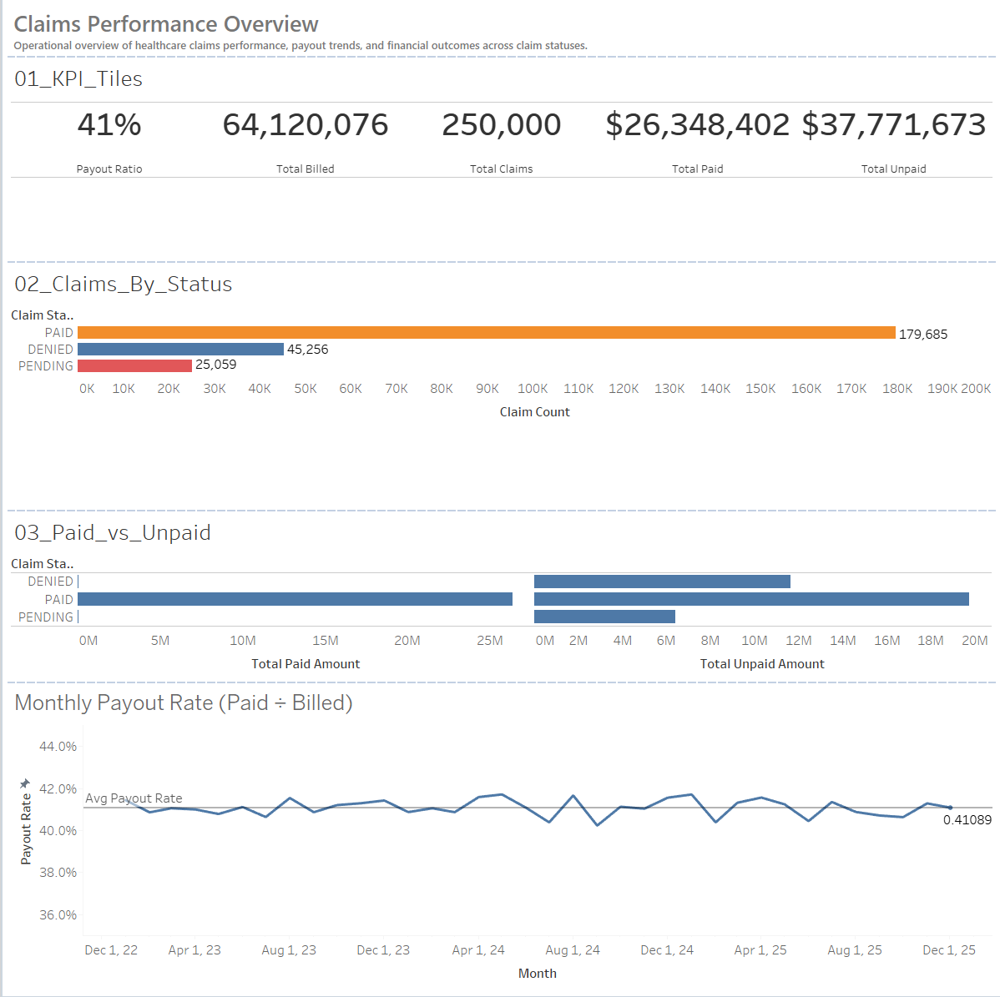
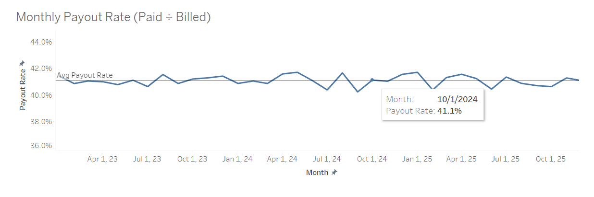
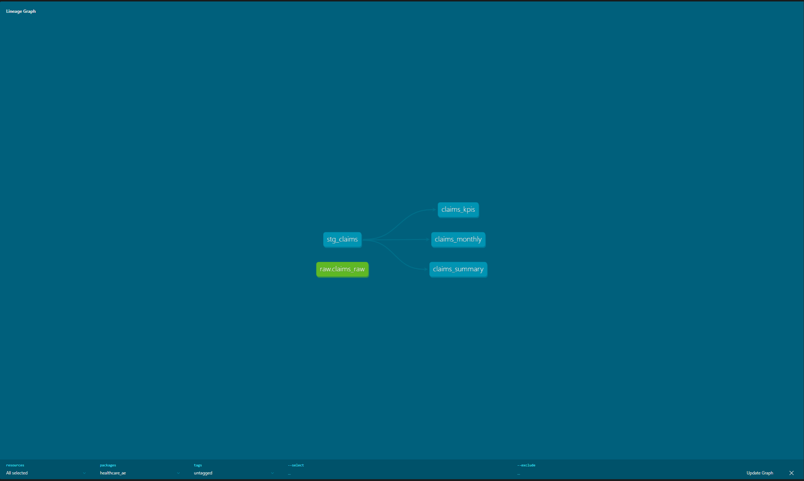

\# Healthcare Claims Analytics Engineering Pipeline

End-to-end analytics engineering project using PostgreSQL, dbt, and Docker.

## 📊 Dashboard Preview

### Claims Performance Overview

### Claim-Level Breakdown

\## Project Structure

\- `healthcare\_ae/` – dbt project (models, tests, snapshots, docs)

\- `data/` – raw CSV data used for ingestion

\- `docker/` – Docker Compose setup for Postgres

\- `src/` – supporting scripts (ETL / loaders)

\- `tableau/` – optional BI layer

\- `docs/` – additional documentation

👉 \*\*See `healthcare\_ae/README.md` for full dbt model and lineage documentation.\*\*

## Data Model Lineage (dbt)

This project follows a layered dbt analytics engineering architecture:

- **Raw layer**: source-aligned ingestion
- **Staging layer**: cleaned and conformed models
- **Mart layer**: analytics-ready KPIs and aggregates for dashboards

\## Tech Stack

\- PostgreSQL

\- dbt Core

\- Docker

\- Python

